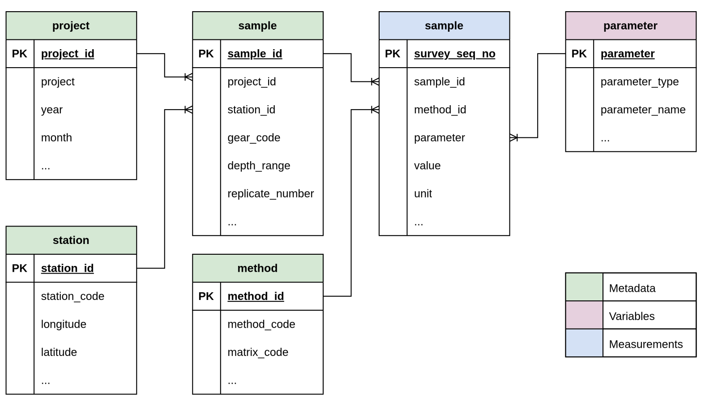

```{css, echo=FALSE}
th {
  white-space: nowrap;
}
```

```{r setup, include=FALSE}
library(tibble)
```

The page shows the database schema diagram along with table definitions based on the 4Demon dataset.

This page documents the database schema for the 4DEMON pilot SQLite database. The schema contains six tables: four independent reference tables and two dependent tables linking samples and measurements.

## DB Schema Diagram

{.zoomable}

---

## project

One row per unique project and survey combination. Captures the monitoring programme context and temporal grouping of samples.

```{r}
tribble(
  ~Name,               ~`Data Type`, ~PK,  ~FK,  ~`NA Allowed`, ~Description,                                                                                         ~`Look Up`,
  "project_id",        "INTEGER",    "✓",  "",    FALSE,         "Primary Key. Auto-generated surrogate key.",                                                         "",
  "project_survey_id", "INTEGER",    "",   "",    FALSE,         "Original numeric project identifier from the source data (1 = UA_VAN_GRIEKEN, 2 = BAGGER, 3 = MONIT_SED, 7 = PMPZ-DBII_PMPZ_COAST).", "",
  "project",           "TEXT",       "",   "",    FALSE,         "Project name (e.g. BAGGER, MONIT_SED, MMP_NS_RBINS-MUMM, PMPZ-DBII_PMPZ_COAST, UA_VAN_GRIEKEN).",   "",
  "campaign_code",     "TEXT",       "",   "",    TRUE,          "Campaign code combining project prefix and year (e.g. 99_1979). Groups samples from the same annual survey leg.", "",
  "year",              "INTEGER",    "",   "",    TRUE,          "Year of sampling (1971–2014).",                                                                       "",
  "month",             "INTEGER",    "",   "",    TRUE,          "Month of sampling (1–12).",                                                                           "",
  "season",            "INTEGER",    "",   "",    TRUE,          "Seasonal quadrimester: 1 = Jan–Apr (winter/spring), 2 = May–Aug (summer), 3 = Sep–Dec (autumn).",    ""
)
```

---

## station

One row per unique sampling location. Includes geographic coordinates and location metadata derived from the coordinates.

```{r}
tribble(
  ~Name,           ~`Data Type`, ~PK,  ~FK,  ~`NA Allowed`, ~Description,                                                              ~`Look Up`,
  "station_id",    "INTEGER",    "✓",  "",    FALSE,         "Primary Key. Auto-generated surrogate key.",                              "",
  "station_code",  "TEXT",       "",   "",    FALSE,         "Station identifier code (162 unique stations in the dataset).",           "",
  "station_group", "TEXT",       "",   "",    TRUE,          "Station group: BCP = Belgian Continental Platform (offshore), BCP_nearby_coast_(<500m) = nearshore stations within 500 m of coast.", "",
  "latitude",      "REAL",       "",   "",    TRUE,          "Corrected latitude of the sampling station (decimal degrees, WGS84).",    "",
  "longitude",     "REAL",       "",   "",    TRUE,          "Corrected longitude of the sampling station (decimal degrees, WGS84).",   "",
  "dist_to_coast", "REAL",       "",   "",    TRUE,          "Distance from station to nearest coastline (km).",                        "",
  "est_country",   "TEXT",       "",   "",    TRUE,          "Estimated country derived from station coordinates.",                     "",
  "country_code",  "TEXT",       "",   "",    TRUE,          "ISO country code (e.g. BE for Belgium).",                                 "",
  "municipality",  "TEXT",       "",   "",    TRUE,          "Municipality name nearest to the station.",                               "",
  "sea_name",      "TEXT",       "",   "",    TRUE,          "Name of the sea or marine region.",                                       ""
)
```

---

## parameter

One row per chemical parameter. Covers ten metals and seven PCB congeners measured in the dataset.

```{r}
tribble(
  ~Name,             ~`Data Type`, ~PK,  ~FK,  ~`NA Allowed`, ~Description,                                                                                   ~`Look Up`,
  "parameter",       "TEXT",       "✓",  "",    FALSE,         "Primary Key. Parameter code (e.g. HG, ZN, CB153).",                                           "",
  "parameter_name",  "TEXT",       "",   "",    TRUE,          "Full parameter name (e.g. mercury, zinc, PCB congener 153).",                                  "",
  "parameter_type",  "TEXT",       "",   "",    TRUE,          "Parameter category: metal (AL, AS, CD, CR, CU, FE, HG, NI, PB, ZN) or PCB (CB28–CB180).",    ""
)
```

---

## method

One row per unique analytical method combination. Captures the harmonised method code, sediment matrix, and grain size fraction analysed.

```{r}
tribble(
  ~Name,               ~`Data Type`, ~PK,  ~FK,  ~`NA Allowed`, ~Description,                                                                                                  ~`Look Up`,
  "method_id",         "INTEGER",    "✓",  "",    FALSE,         "Primary Key. Auto-generated surrogate key.",                                                                  "",
  "method_seq_no",     "INTEGER",    "",   "",    FALSE,         "Original sequential method identifier from the source data (102 unique methods).",                            "",
  "method_code",       "TEXT",       "",   "",    TRUE,          "Harmonised analytical method code combining project, technique, and fraction (e.g. Monit3_OES/MS_63 = monitoring period 3, ICP-OES/MS, <63 µm).", "",
  "matrix_code",       "TEXT",       "",   "",    TRUE,          "Sediment matrix code: FS = fine sediment (<63 µm fraction), US = unsieved/bulk sediment.",                   "",
  "fraction_range_um", "TEXT",       "",   "",    TRUE,          "Grain size fraction analysed in micrometres (e.g. 0-63 = fine fraction <63 µm, 0-2000 = bulk <2 mm).",      ""
)
```

---

## sample

One row per physical sample event, linking each sample to its station and project context.

```{r}
tribble(
  ~Name,               ~`Data Type`, ~PK,  ~FK,                          ~`NA Allowed`, ~Description,                                                                                         ~`Look Up`,
  "sample_id",         "INTEGER",    "✓",  "",                           FALSE,         "Primary Key. Auto-generated surrogate key.",                                                         "",
  "sample_seq_no",     "INTEGER",    "",   "",                           FALSE,         "Original sequential sample identifier from the source data (1,612 unique samples).",                 "",
  "station_id",        "INTEGER",    "",   "station (station_id)",        FALSE,         "Foreign Key to the station table.",                                                                   "",
  "project_id",        "INTEGER",    "",   "project (project_id)",        FALSE,         "Foreign Key to the project table.",                                                                   "",
  "sample_ref_code",   "TEXT",       "",   "",                           TRUE,          "Original sample reference code combining station, gear, and timestamp (e.g. 99_1979-120-VV-1/01/1979 12:00).", "",
  "sample_timestamp",  "TEXT",       "",   "",                           TRUE,          "Timestamp assigned to the sample event (DD/MM/YYYY HH:MM). Often set to 01/01/YYYY 12:00 when exact date is unknown.", "",
  "start_date",        "TEXT",       "",   "",                           TRUE,          "Actual sampling date and time where known (DD/MM/YYYY HH:MM).",                                     "",
  "gear_code",         "TEXT",       "",   "",                           TRUE,          "Sampling gear code: VV = Van Veen grab, BC = box corer.",                                            "",
  "depth_range",       "TEXT",       "",   "",                           TRUE,          "Sediment depth range sampled (always 0-20 cm in this dataset).",                                     "",
  "replicate_number",  "INTEGER",    "",   "",                           TRUE,          "Replicate index for repeated measurements on the same sample (1, 2, or 3).",                        ""
)
```

---

## sediment

The fact table storing one measurement per row. Each row links a sample to its analytical method and parameter, and records the measured value alongside quality flags.

```{r}
tribble(
  ~Name,                  ~`Data Type`, ~PK,  ~FK,                        ~`NA Allowed`, ~Description,                                                                                                   ~`Look Up`,
  "survey_seq_no",        "INTEGER",    "✓",  "",                         FALSE,         "Primary Key. Original sequential survey value identifier — unique per measurement row.",                       "",
  "sample_id",            "INTEGER",    "",   "sample (sample_id)",        FALSE,         "Foreign Key to the sample table.",                                                                             "",
  "method_id",            "INTEGER",    "",   "method (method_id)",        FALSE,         "Foreign Key to the method table.",                                                                             "",
  "parameter",            "TEXT",       "",   "parameter (parameter)",     FALSE,         "Foreign Key to the parameter table.",                                                                          "",
  "value",                "REAL",       "",   "",                         TRUE,          "Original measured value in µg/g dry weight.",                                                                  "",
  "corrected_value",      "REAL",       "",   "",                         TRUE,          "Corrected value after quality control (e.g. below-detection substitutions). Recommended for analysis.",        "",
  "unit",                 "TEXT",       "",   "",                         TRUE,          "Unit of measurement (µg/g dry weight for all rows).",                                                          "",
  "value_flag",           "INTEGER",    "",   "",                         TRUE,          "Data quality flag: 0 = valid, 1 = suspect, 2 = below detection limit, 3 = invalid.",                          "",
  "det_limit_flag",       "INTEGER",    "",   "",                         TRUE,          "Detection limit flag: 0 = above detection limit, 1 = at or below detection limit.",                            "",
  "range_check_flag",     "INTEGER",    "",   "",                         TRUE,          "Range check flag: 0 = within expected range, 1 = outside expected range, NA = not checked.",                   "",
  "outlier_extreme_flag", "INTEGER",    "",   "",                         TRUE,          "Extreme outlier flag per parameter: 0 = normal, 1 = moderate outlier, 2 = extreme outlier.",                   "",
  "outlier_stdev_flag",   "INTEGER",    "",   "",                         TRUE,          "Standard deviation outlier flag: 0 = within normal range, 1 = outlier based on standard deviation threshold.", ""
)

```
